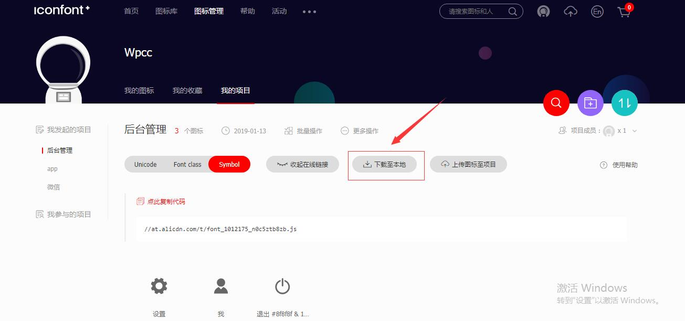
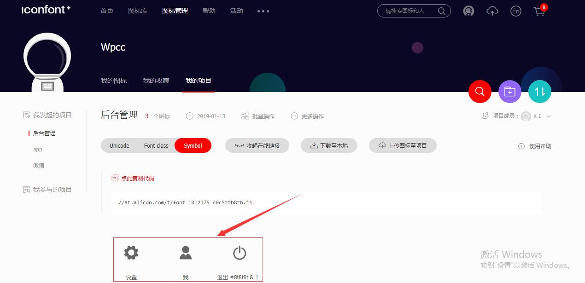
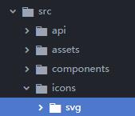

## svg的使用

### 前言

这篇[文档](https://www.zhangxinxu.com/wordpress/2014/07/introduce-svg-sprite-technology/)详细介绍了svg图片的使用。

这篇文档详细介绍svg图片中的`<g>、<defs>、<>symbol>、<use>`元素。

### 使用方法

通常情况下svg图片的使用有两种：

- 第一种，直接在html页面上引用，如以下代码：

```html
<!DOCTYPE html>
<html lang="en">
<head>
  <meta charset="UTF-8">
  <meta name="viewport" content="width=device-width, initial-scale=1.0">
  <meta http-equiv="X-UA-Compatible" content="ie=edge">
  <title>Document</title>
</head>
<body>
<div>
  <svg class="icon" viewBox="0 0 1024 1024" xmlns="http://www.w3.org/2000/svg" width="200" height="200"><defs></defs><path d="M888 913.5c0 7.4-6 13.3-13.3 13.3H149.3c-7.4 0-13.3-6-13.3-13.3 0-1.1.1-2.1.4-3.1 6.8-157 109.8-289.1 251.7-338.6l116.7 116.7c4 4 10.5 4 14.5 0L636 571.8c141.8 49.5 244.9 181.6 251.7 338.6.2 1 .3 2 .3 3.1zM512 550.8c-124.5 0-225.4-100.9-225.4-225.4S387.5 100.1 512 100.1 737.4 201 737.4 325.4 636.5 550.8 512 550.8z"/></svg>
</div>
</body>
</html>
```

- 第二种，将图片放置在symbol容器当中，通过symbol提供的use方法进行引用：

```html
<!DOCTYPE html>
<html lang="en">
<head>
  <meta charset="UTF-8">
  <meta name="viewport" content="width=device-width, initial-scale=1.0">
  <meta http-equiv="X-UA-Compatible" content="ie=edge">
  <title>Document</title>
</head>
<body>
  <svg aria-hidden="true" style="position:absolute;width:0;height:0;overflow:hidden">
    <symbol id="icon-me" viewBox="0 0 1024 1024">
      <path d="M888 913.5c0 7.4-6 13.3-13.3 13.3H149.3c-7.4 0-13.3-6-13.3-13.3 0-1.1.1-2.1.4-3.1 6.8-157 109.8-289.1 251.7-338.6l116.7 116.7c4 4 10.5 4 14.5 0L636 571.8c141.8 49.5 244.9 181.6 251.7 338.6.2 1 .3 2 .3 3.1zM512 550.8c-124.5 0-225.4-100.9-225.4-225.4S387.5 100.1 512 100.1 737.4 201 737.4 325.4 636.5 550.8 512 550.8z"/>
    </symbol>
  </svg>
<div>
  <svg class="icon svg-icon" aria-hidden="true">
    <use xlink:href="#icon-me"></use> <!--通过use引用-->
  </svg>
</div>
</body>
<style>

</style>
</html>
```

这种方法的好处在于，在使用svg只需简单的调用即可。

而以下介绍的两种方法，都是基于symbol，动态地在页面生成放置svg的symbol容器，以致于在开发过程中通过简单地调用便能使用svg。

>  symbol的IE兼容是IE9+

以下以vue框架为例（以下内容构建在VueCli3.0+），具体谈一谈svg在项目中的实际使用：

#### iconfont.js

通过阿里的[iconfont网站](https://www.iconfont.cn/home/index)可以下载svg图片，该网站下载的图片默认会放在一个文件夹中并提供iconfont.js文件，在项目中引入该文件便能直接使用，具体步骤如下：

1. iconfont网站上的下载位置：



2. 在main.js中引入iconfont.js文件，`import '@/icons/iconfont.js'`
3. 为了方便使用，进行适当地文件封装，具体编码如下：

```vue
<template>
  <div id="app">
    <svg class="icon" aria-hidden="true">
      <use xlink:href="iconName"></use>
    </svg>
  </div>
</template>
<script>
export defaule {
	props: {
        iconClass: {
            type: String,
            required： true
        }
	},
	computed: {
        iconName () {
            return `#icon-${this.iconClass}`
        }
	}
}
</script>
<style media="screen">
  .icon{
    width:1em;
    height:1em;
    vertical-align:-0.15em;
    fill:currentColor;
    overflow: hidden;
  }
</style>
```

该方法存在的缺点：

1. 当修改svg单个图标的时候，必须替换整个iconfont.js脚本。

2. iconfont.js在main中引入，故生成的位置是主页面，无法进行动态加载（个人觉得通过svg-sprite-loader生成的svg图片也没有完全实现动态加载）。

#### svg-sprite-loader

svg-sprite-loader会将引入的svg打包在symbol中，然后放置在引入页面body并隐藏该元素，这样就可以通过use便捷地使用svg图片了。

具体步骤如下：

1. iconfont网站上的下载位置：

   

2. 通过svgo插件对下载的svg进行压缩，具体可参考该[文档](https://www.zhangxinxu.com/wordpress/2016/02/svg-compress-tool-svgo-experience/)。

   - 第一步，安装svgo插件

   ```shell
   npm i -g svgo
   ```

   - 第二步，使用svgo对svg文件进行压缩

   ```shell
   # 例如：放置svg的文件为icon，需要注意地是，输出目录需要手动创建
   svgo -f icon -o icon/output
   ```

   svgo压缩的体积在20%~50%之间。

   - 第三步，将压缩后的svg文件放置在vue工程目录下

     

3. 利用svg-sprite-loader将引入的svg合并转换成svg-sprite（即放置在symbol中）

   - 第一步，安装svg-sprite-loader插件

   ```shell
   npm i svg-sprite-loader -D
   ```

   - 第二步，由于VueCli3.0中对svg默认处理的加载器是file-loader，故需要通过vue.config.js配置文件对该配置进行重新配置处理。[点击这里](https://github.com/vuejs/vue-cli/blob/dev/packages/%40vue/cli-service/lib/config/base.js)你可以查看VueCli3.0中webpack的基本配置项，该配置是基于[webpack-chain](https://github.com/neutrinojs/webpack-chain)进行维护的。至于具体的处理逻辑请查看[手摸手icon篇](https://juejin.im/post/59097cd7a22b9d0065fb61d2)。

   ```shell
   //vue.config.js配置文件
   module.exports = {
       lintonSave:false,
       chainWebpack:config =>{
           //更改原来svg配置处理loader
           const svgRule = config.module.rule('svg)
           svg.Rule
           .exclude
           	.add(resolve('src/icons))
           	.end()
           	
           //添加新的svg配置处理loader
           config.module
           	.rule('svg-sprite-loader)
               .test(/\.svg$/)
               .include
                   .add(resolve('src/icons))
                   .end()
               .use('svg-sprite-loader')
                   .loader('svg-sprite-loader)
                   .options({
                       symbolId:'icon-[name]
                   })
       }
   }
   ```

4. 封装IconSvg组件：

```vue
// 组件SvgIcon.vue
<template lang="html">
  <svg class="svg-icon" aria-hidden="true">
    <use :xlink:href="iconName"></use>
  </svg>
</template>

<script>
import '@/icons/me.svg'
export default {
  name: 'icon-svg',
  props: {
    iconClass:{
      type: String,
      required: true
    }
  },
  computed: {
    iconName(){
      return `#icon-${this.iconClass}`
    }
  }
}
</script>

<style lang="css">
.svg-icon{
  width:1em;
  height: 1em;
  vertical-align: -0.15em;
  fill:currentColor;
  overflow: hidden;
}
</style>
```

```vue
// App.vue
<template>
  <div id="app">
    <IconSvg :iconClass="'me'"></IconSvg>
  </div>
</template>
<script>
import IconSvg from '@/components/IconSvg.vue'
export default {
  components:{
    IconSvg
  }
}
</script>
```

5. 至此，便实现了通过自定义组件在Vue中使用svg图片了。但是，如果仔细观察IconSvg.vue会发现，当使用svg的时候会通过`import '@/icons/me.svg'`进行引用，一个页面当然不止一个svg图片，要知道懒惰是第一生产力，通过webpack提供的require.context便能够一次引入文件夹里面的所有文件。[官方文档](https://webpack.js.org/guides/dependency-management/#require-context)

```javascript
const requireAll = (requireContext) => {
    requireContext.keys().map(requireContext)
}
const req = require.context('../icons',false,/\.svg$/) 
//require.context提供的三个参数，分别是检索文件夹，是否检测文件夹中的子文件，以及文件夹名。
requireAll(req)
```

故以上的IconSvg可以改写成如下内容：

```html
<template lang="html">
  <svg class="svg-icon" aria-hidden="true">
    <use :xlink:href="iconName"></use>
  </svg>
</template>

<script>
/*
  通过requireContext引入icons目录下的所有svg图片
*/
const requireAll = (requireContext) =>{
  requireContext.keys().map(requireContext)
}
const req = require.context('../icons',false,/\.svg$/)
requireAll(req)

export default {
  name: 'icon-svg',
  props: {
    iconClass:{
      type: String,
      required: true
    }
  },
  computed: {
    iconName(){
      return `#icon-${this.iconClass}`
    }
  }
}
</script>

<style lang="css">
.svg-icon{
  width:1em;
  height: 1em;
  vertical-align: -0.15em;
  fill:currentColor;
  overflow: hidden;
}
</style>

```


> 通过clone 该[项目](https://github.com/Wpcc/back-stage-management)中的SVG-usage-scheme可以查看具体代码