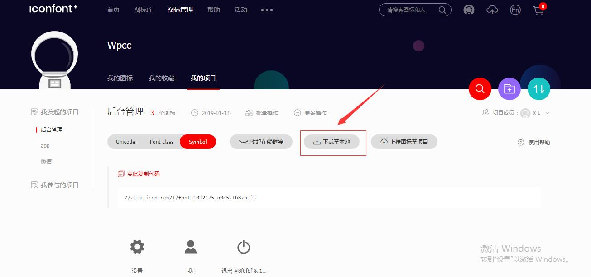
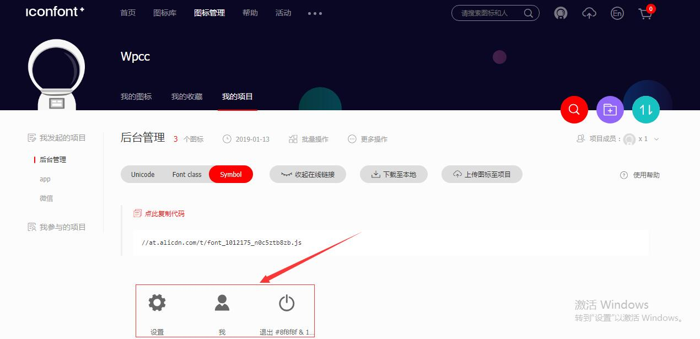

## 项目说明
### 升级内容

**变量：**

​	将vue2.0+中webpack中的变量定义转换为vue3.0中的变量定义。区别在于：vue2.0+中的环境变量是直接定义在webpack中，而vue3.0对webpack做了一个封装，故变量需要定义在.env开头的文件中。

```javascript
//.env
VUE_APP_URL = https://easy-mock.com/mock/5950a2419adc231f356a6636/vue-admin
```


**本地服务器设置：**

​	也就是webpack中的devSever设置：

```javascript
module.exports = {
  devServer: {
    open:true,
    host:'localhost',
    port:9528
  }
}
```


### 包安装

```json
axios
element-ui
js-cookie
normalize.css
nprogress
```


### API

| 功能         | 方式 | 地址                                                         | 参数         |
| ------------ | ---- | ------------------------------------------------------------ | ------------ |
| 用户登录     | post | https://easy-mock.com/mock/5950a2419adc231f356a6636/vue-admin/user/login | user_account |
| 获取用户信息 | get  | https://easy-mock.com/mock/5950a2419adc231f356a6636/vue-admin/user/info?token=admin | token        |
| 退出登录     | post | https://easy-mock.com/mock/5950a2419adc231f356a6636/vue-admin/user/logout | 无参数       |
| 表格信息     | get  | https://easy-mock.com/mock/5950a2419adc231f356a6636/vue-admin/table/list | 无参数       |

以上参数：

`user_account = {username:admin;password:admin}`

`token = 'token = admin'`

**状态码：**

​	50000：账号密码错误

​	20000：账号密码正确

### easy-mock

| id(id) | 访问链接(link)                           | 操作类型(type) | 对应内容(content) | 访客IP(ip)     | 次数(number) | 时间(time)          | 操作(operation) |
| ------ | ---------------------------------------- | -------------- | ----------------- | -------------- | ------------ | ------------------- | --------------- |
| 6200   | http://fz.bdcgw.cn/weixin/uc/xld18052902 | 点击           | 领取牛股          | 153.34.106.214 | 1            | 2019-02-28 14:47:42 | 删除            |
| 6199   | http://fz.bdcgw.cm/weixin/gzhfg/xld101   | 复制           | 二维码            | 117.90.103.219 | 1            | 2018-12-06 16:12:43 | 删除            |

数据地址：[监测统计后台](http://zb.bdcgw.cn/monitor_report.php)

数据格式：

```json
{
    "code":20000,
    "data":{
        "items":[
            {
                "id":6200,
                "link":"http://fz.bdcgw.cn/weixin/uc/xld18052902",
                "type":"点击",
                "content":"领取牛股",
                "ip":"153.34.106.214",
                "number":"1",
                "time":"2019-02-28 14:47:42",
                "operation":"删除"
            }
        ]
    }
}
```


### svg图片处理

关于svg图片的具体使用看这篇[文档](https://www.zhangxinxu.com/wordpress/2014/07/introduce-svg-sprite-technology/)。

关于svg图片`<g>、<defs>、<symbol>、<use>`元素的介绍看这篇[文档](http://www.softwhy.com/article-122-1.html)

通常情况下svg图片有两种使用方法：

- 第一种，直接在html页面上引用，以下面的代码为例：

```html
<!DOCTYPE html>
<html lang="en">
<head>
  <meta charset="UTF-8">
  <meta name="viewport" content="width=device-width, initial-scale=1.0">
  <meta http-equiv="X-UA-Compatible" content="ie=edge">
  <title>Document</title>
</head>
<body>
<div>
  <svg class="icon" viewBox="0 0 1024 1024" xmlns="http://www.w3.org/2000/svg" width="200" height="200"><defs></defs><path d="M888 913.5c0 7.4-6 13.3-13.3 13.3H149.3c-7.4 0-13.3-6-13.3-13.3 0-1.1.1-2.1.4-3.1 6.8-157 109.8-289.1 251.7-338.6l116.7 116.7c4 4 10.5 4 14.5 0L636 571.8c141.8 49.5 244.9 181.6 251.7 338.6.2 1 .3 2 .3 3.1zM512 550.8c-124.5 0-225.4-100.9-225.4-225.4S387.5 100.1 512 100.1 737.4 201 737.4 325.4 636.5 550.8 512 550.8z"/></svg>
</div>
</body>
</html>
```

- 第二种，将图片放置在symbol当中，通过symbol提供的use方法进行引用：

```html
<!DOCTYPE html>
<html lang="en">
<head>
  <meta charset="UTF-8">
  <meta name="viewport" content="width=device-width, initial-scale=1.0">
  <meta http-equiv="X-UA-Compatible" content="ie=edge">
  <title>Document</title>
</head>
<body>
  <svg aria-hidden="true" style="position:absolute;width:0;height:0;overflow:hidden">
    <symbol id="icon-me" viewBox="0 0 1024 1024">
      <path d="M888 913.5c0 7.4-6 13.3-13.3 13.3H149.3c-7.4 0-13.3-6-13.3-13.3 0-1.1.1-2.1.4-3.1 6.8-157 109.8-289.1 251.7-338.6l116.7 116.7c4 4 10.5 4 14.5 0L636 571.8c141.8 49.5 244.9 181.6 251.7 338.6.2 1 .3 2 .3 3.1zM512 550.8c-124.5 0-225.4-100.9-225.4-225.4S387.5 100.1 512 100.1 737.4 201 737.4 325.4 636.5 550.8 512 550.8z"/>
    </symbol>
  </svg>
<div>
  <svg class="icon svg-icon" aria-hidden="true">
    <use xlink:href="#icon-me"></use> <!--通过use引用-->
  </svg>
</div>
</body>
<style>

</style>
</html>
```

目前流行的是symbol使用方法，这是因为通过js可以直接在页面上生成放置在symbol容器中的svg图片，以致于在项目开发中，只需要简单的代码引用就可以使用svg图片。需要注意地是symbol的IE兼容是IE9+。

下面以vue框架为例（以下内容构建在VueCli3.0+），具体谈一谈svg在项目中的实际使用：

针对阿里的[iconfont网站](https://www.iconfont.cn/home/index)上导出的svg图片处理，一般分为两种情况：

第一种是使用symbol方法，该方法下载的文件会自动将svg图片放置在iconfont.js文件中，在项目中引入该文件便能直接使用：

1. 使用symbol时候，iconfont网站上的下载位置：



2. 在main.js中引入Iconfont.js文件，`import '@/icons/iconfont.js'`

3. 生成IconSvg.vue组件，具体编码如下：

```vue
<template>
  <div id="app">
    <svg class="icon" aria-hidden="true">
      <use xlink:href="iconName"></use>
    </svg>
  </div>
</template>
<script>
export defaule {
	props: {
        iconClass: {
            type: String,
            required： true
        }
	},
	computed: {
        iconName () {
            return `#icon-${this.iconClass}`
        }
	}
}
</script>
<style media="screen">
  .icon{
    width:1em;
    height:1em;
    vertical-align:-0.15em;
    fill:currentColor;
    overflow: hidden;
  }
</style>
```


第二种直接下载svg源文件，创建一个icon-component组件，通过svg-sprite-loader将svg放置在symbol容器当中：

1. 使用symbol时候，iconfont网站上的下载位置：



2.这一步并不是必需得，svg的源文件信息包含一些无用信息，通过svgo可以进行压缩，[参考文档](https://www.zhangxinxu.com/wordpress/2016/02/svg-compress-tool-svgo-experience/)

- 第一步，安装svgo插件

```shell
npm i -g svgo
```

- 第二步，使用svgo对svg文件进行压缩

```shell
# 例如：放置svg的文件为icon，需要注意地是，输出目录需要手动创建
svgo -f icon -o icon/output
```

一般情况下，svgo压缩的体积在20%~50%之间。

- 第三步，将压缩后的svg文件放置到vue工程目录中

  

3. 利用[svg-sprite-loader](https://juejin.im/post/59bb864b5188257e7a427c09#comment)加载器将svg文件夹中的svg文件转换成svg-sprite文件。

- 第一步，安装svg-sprite-loader插件

```shell
npm i svg-sprite-loader -D
```

- 第二步，由于VueCli3.0中对svg默认处理的加载器是file-loader，故需要通过vue.config.js配置文件对该配置进行重新配置处理。[点击这里](https://github.com/vuejs/vue-cli/blob/dev/packages/%40vue/cli-service/lib/config/base.js)你可以查看VueCli3.0中webpack的基本配置项，该配置是基于[webpack-chain](https://github.com/neutrinojs/webpack-chain)进行维护的。至于具体的处理逻辑请查看[手摸手icon篇](https://juejin.im/post/59097cd7a22b9d0065fb61d2)。

```javascript
//vue.config.js配置文件
module.exports = {
    lintonSave:false,
    chainWebpack:config =>{
        //更改原来svg配置处理loader
        const svgRule = config.module.rule('svg)
        
        svgRule
        .exclude
        	.add(resolve('src/icons))
        	.end()
        	
        //添加新的svg配置处理loader
        config.module
        .rule('svg-sprite-loader)
        .test(/\.svg$/)
        .include
        	.add(resolve('src/icons))
        	.end()
        	.use('svg-sprite-loader')
        		.loader('svg-sprite-loader)
        		.options({
                    symbolId:'icon-[name]
        		})
    }
}
```

3. 在component文件夹下创建svg组件，并引入使用：

```html
// 组件SvgIcon.vue
<template lang="html">
  <svg class="svg-icon" aria-hidden="true">
    <use :xlink:href="iconName"></use>
  </svg>
</template>

<script>
import '@/icons/me.svg'
export default {
  name: 'icon-svg',
  props: {
    iconClass:{
      type: String,
      required: true
    }
  },
  computed: {
    iconName(){
      return `#icon-${this.iconClass}`
    }
  }
}
</script>

<style lang="css">
.svg-icon{
  width:1em;
  height: 1em;
  vertical-align: -0.15em;
  fill:currentColor;
  overflow: hidden;
}
</style>
```

```html
// App.vue
<template>
  <div id="app">
    <IconSvg :iconClass="'me'"></IconSvg>
  </div>
</template>
<script>
import IconSvg from IconSVG.vue
export default {
  components:{
    IconSvg
  }
}
</script>
```

4. 至此，便实现了通过自定义组件在Vue中使用svg图片了。但是，如果仔细观察IconSvg.vue会发现，当使用svg的时候会通过`import '@/icons/me.svg'`进行引用，一个页面当然不止一个svg图片，要知道懒惰是第一生产力，通过webpack提供的require.context便能够一次引入文件夹里面的所有文件。[官方文档](https://webpack.js.org/guides/dependency-management/#require-context)

```javascript
const requireAll = (requireContext) => {
    requireContext.keys().map(requireContext)
}
const req = require.context('../icons',false,/\.svg$/) 
//require.context提供的三个参数，分别是检索文件夹，是否检测文件夹中的子文件，以及文件夹名。
requireAll(req)
```

​	故以上component中的IconSvg.vue可以改写成如下内容：

```html
<template lang="html">
  <svg class="svg-icon" aria-hidden="true">
    <use :xlink:href="iconName"></use>
  </svg>
</template>

<script>
/*
  通过requireContext引入icons目录下的所有svg图片
*/
const requireAll = (requireContext) =>{
  requireContext.keys().map(requireContext)
}
const req = require.context('../icons',false,/\.svg$/)
requireAll(req)

export default {
  name: 'icon-svg',
  props: {
    iconClass:{
      type: String,
      required: true
    }
  },
  computed: {
    iconName(){
      return `#icon-${this.iconClass}`
    }
  }
}
</script>

<style lang="css">
.svg-icon{
  width:1em;
  height: 1em;
  vertical-align: -0.15em;
  fill:currentColor;
  overflow: hidden;
}
</style>

```

以上代码内容放置在GithubXXXX上，你可以通过……

### 侧边栏渲染

根据路由渲染侧边栏，通常用于不同用户的权限划分。该方法的实现有两种，将路由表放置在后端，通过接口拿到该路由表并动态的挂载到前端路由。第二种，将路由放置在前端，通过后端对应的权限，将对应路由挂载到前端路由。

**第一种方法（具体实现步骤）：**

- 保存在后端服务器中的路由表是字符串，需做进一步转换，即将路由中组件对应的字符串替换成变量。

```javascript
//后端路由表
roles: {
          name: "admin",
          avatar: "http://www.qiaofangzidemao.top/database/back-stage/avatar-5.png",
          routes: [{
              path: '/login',
              component: '@/views/login/index',
              hidden: true
            },
            {
              path: '/404',
              component: '@/views/404',
              hidden: true
            },

            {
              path: '/',
              component: 'Layout',
              redirect: '/home',
              children: [{
                path: 'home',
                component: '@/views/home',
                meta: {
                  title: 'Home',
                  icon: 'home'
                }
              }]
            },
            {
              path: '/example',
              component: 'Layout',
              redirect: '/example/table',
              meta: {
                title: 'Example',
                icon: 'example'
              },
              children: [{
                  path: 'table',
                  component: '@/views/table/index',
                  meta: {
                    title: 'Table',
                    icon: 'table'
                  }
                },
                {
                  path: 'tree',
                  component: '@/views/tree/index',
                  meta: {
                    title: 'Tree',
                    icon: 'tree'
                  }
                }
              ]
            },
            {
              path: '/form',
              component: 'Layout',
              redirect: '/form/index',
              children: [{
                path: 'index',
                component: '@/views/form',
                meta: {
                  title: 'Form',
                  icon: 'form'
                }
              }]
            },
            {
              path: 'nested',
              component: 'Layout',
              redirect: '/nested/munu1',
              meta: {
                title: 'Nested',
                icon: 'nested'
              },
              children: [{
                  path: 'menu1',
                  component: '@/views/nested/munu1',
                  meta: {
                    title: 'Menu1',
                    icon: 'nested'
                  },
                  children: [{
                      path: 'menu1-1',
                      component: '@/views/nested/menu1/menu1-1',
                      meta: {
                        title: 'Menu1-1',
                        icon: 'nested'
                      }
                    },
                    {
                      path: 'menu1-2',
                      component: '@/views/nested/menu1/menu1-2',
                      meta: {
                        title: 'Menu1-2',
                        icon: 'nested'
                      },
                      children: [{
                          path: 'menu1-2-1',
                          component: '@/views/nested/munu1/menu1-2/menu1-2-1',
                          meta: {
                            title: 'Menu1-2-1',
                            icon: 'nested'
                          }
                        },
                        {
                          path: 'menu1-2-2',
                          component: '@/views/nested/menu1/menu1-2/menu1-2-2',
                          meta: {
                            title: 'Menu1-2-2',
                            icon: 'nested'
                          }
                        },
                      ]
                    },
                    {
                      path: 'menu1-3',
                      component: '@/views/nested/menu1-3',
                      meta: {
                        title: 'Menu1-3',
                        icon: 'nested'
                      }
                    }
                  ]
                },
                {
                  path: 'menu2',
                  component: '@/views/nested/menu2/index',
                  meta: {
                    title: 'Menu2',
                    icon: 'menu2'
                  }
                }
              ]
            },
            {
              path: '*',
              redirect: '/404',
              hidden: true
            }
          ]
        }
```

```javascript
//替换函数
function transformRouter (routes = []) {
  routes.forEach(item => {
    if (item.component == 'Layout') {
      item.component = Layout
    } else {
      item.component = () => import(item.component)
    }
    if (item.children) {
      transformRouter(item.children)
    }
  })
}
```

- 通过router提供的API将替换好的路由表动态地挂载到router上。

```javascript
//router挂载API
router.addRoutes(routes)
```

- 将保存在localStorage中的routes渲染成对应侧边栏(配合elementUI)，由于用到递归遍历，故将侧边栏组件进行拆分。

```vue
<!-- index.vue -->
<template>
  <div class="w-sidebar">
    <el-col :span="24">
      <el-menu
        default-active="2"
        class="el-menu-vertical-demo"
        @open="handleOpen"
        @close="handleClose"
        background-color="#304156"
        text-color="#fff"
        :style="resetStyle">
        <template v-if="routes">
          <Item
            v-for="route in routes"
            v-if="!route.hidden"
            :route="route"
            :baseUrl="route.path" >
          </Item>
        </template>
      </el-menu>
    </el-col>
  </div>
</template>
<script>
  import Item from './item'
  export default {
    data () {
      return {
        resetStyle: {
          'border-right' : '1px solid #304156',
        }
      }
    },
    components: {
      Item
    },
    computed: {
      routes () {
        return this.$store.state.user.roles.routes
      }
    },
    methods: {
      handleOpen(key, keyPath) {
        console.log(key, keyPath);
      },
      handleClose(key, keyPath) {
        console.log(key, keyPath);
      }
    }
  }
</script>

```

```vue
<!-- item.vue -->
<template>
  <div>
    <router-link v-if="!route.meta" :to="fullUrl(route.children[0].path)">
      <el-menu-item :index="fullUrl(route.children[0].path)">
        <span>{{route.children[0].meta.title}}</span>
      </el-menu-item>
    </router-link>
    <template v-else>
      <router-link v-if="!route.children" :to="fullUrl(route.path)">
        <el-menu-item :index="fullUrl(route.path)">
          <span>{{route.meta.title}}</span>
        </el-menu-item>
      </router-link>
      <el-submenu v-else :index="fullUrl()">
        <template slot="title">
          <span>{{route.meta.title}}</span>
        </template>
        <Item v-for="item in route.children" :route="item" :baseUrl="fullUrl(route.path)"></Item>
      </el-submenu>
    </template>
  </div>
</template>
<script>
  import path from 'path'
  export default {
    name: 'Item',
    props: {
      route: {
        type: Object,
        required: true
      },
      baseUrl: {
        type: String,
        required: true,
        default:''
      }
    },
    methods: {
      fullUrl (url = '') {
        return path.resolve(this.baseUrl, url)
      }
    }
  }
</script>

```


### 项目优化

#### 包分析插件

在vueCli3.0中并没有集成webpack-bundle-analyzer插件，故需要手动安装：

```shell
npm i webpack-bundle-analyzer -D
```

并在vue.config.js中进行配置（该配置采用的是webpack-chain方式）：

```javascript
module.exports = {
    chainWebpack: config => {
        if(process.env.NODE_ENV === 'production'){
            //判断npm中的script脚步是不是运行的是 analyzer
            if(precess.env.npm_lifecycle_event === 'analyze'){
                config
                	.plugin('webpack-bundle-analyzer')
                .use(require('webpack-bundle-analyzer').BundleAnalyzerPlugin)
            }
        }
    }
}
```

同时添加package.json中的script启动脚本：

```javas
"analyze":"vue-cli-service build"
```

当在命令行中输入以下命令会自动生成一个关于打包文件体积的可视化分析页面：

```shell
npm run analyze
```

分析页面如下：


#### 第三方包走CDN

前段时间看到一个[博客](https://juejin.im/post/5c3c544c6fb9a049d37f5903)，大致意思是将vue打包后的文件依赖也就是第三方包走CDN，换言之就是使用网络引用第三方包，而不是下载到本地打包。

虽然鄙人没有在大公司待过，但依旧觉得这种项目优化方案在大多数情况下不太实用。

原因有二：

​	其一，前端优化的策略应该是尽可能减少http请求，而第三方包走CDN，无异于是反其道而行。

​	其二，vue项目引入的包文件是基于运行时的文件，这相比CDN引入的文件要小30%~40%。[官方文档](https://cn.vuejs.org/v2/guide/installation.html)

话不多少，下面以代码来简单实现一下这两种方案，以下代码基于VueCLI3.0脚手架。

**直接打包：**

- 创建一个简单的项目实例

```shell
# VueCli3.0内部集成了基本的webpack配置，在此处选择最简单的默认（default）配置即可
vue cteate demo
```

- 打包

```shell
npm run build
```

可以看到项目打包体积如下：


**第三方包走CDN：**

如果确定第三方包走CDN，那么需要做一些额外的配置：

- 首先需要找到能够提供第三方包源码的网站，这里楼主采用地是[BootCDN](https://www.bootcdn.cn/)。并通过项目中package.json找到对应下载的包版本号，并与第三方包的版本一一对应起来。
- 将下载地址放置到html文件中，也就是工程目录下public中的index.html，这里楼主是将文件引入地址放置在.env，然后通过插值表达式在index.html引入。你可以查看以下官方文档了解更详细内容[环境变量](https://cli.vuejs.org/zh/guide/mode-and-env.html#%E6%A8%A1%E5%BC%8F)，[插值表达式](https://cli.vuejs.org/zh/guide/html-and-static-assets.html#%E6%8F%92%E5%80%BC)。

```text
// .env
VUE_APP_JS_VUE = https://cdn.bootcss.com/vue/2.5.22/vue.min.js
VUE_APP_JS_VUEX = https://cdn.bootcss.com/vuex/3.0.1/vuex.min.js
VUE_APP_JS_VUEROUTER = https://cdn.bootcss.com/vue-router/3.0.1/vue-router.min.js
```

```html
<!DOCTYPE html>
<html lang="en">
  <head>
    <meta charset="utf-8">
    <meta http-equiv="X-UA-Compatible" content="IE=edge">
    <meta name="viewport" content="width=device-width,initial-scale=1.0">
    <link rel="icon" href="<%= BASE_URL %>favicon.ico">
    <script src="<%= process.env.VUE_APP_JS_VUE%>"></script>
    <script src="<%= process.env.VUE_APP_JS_VUEX%>"></script>
    <script src="<%= process.env.VUE_APP_JS_VUEROUTER%>"></script>
    <title>demo02</title>
  </head>
  <body>
    <noscript>
      <strong>We're sorry but demo02 doesn't work properly without JavaScript enabled. Please enable it to continue.</strong>
    </noscript>
    <div id="app"></div>
    <!-- built files will be auto injected -->
  </body>
</html>
```

- 当然仅仅这些是不够的，还需要通过vue.config.js去配置webpack中的externals，那么webpack中的externals主要做什么呢？

  - [官方文档](https://webpack.docschina.org/configuration/externals/)
  - 换言之，也就是将页面中`import Vue from 'vue'`，这种包引入通过查找页面中引入的全局变量进行替换，也就是说你必须知道用import引用的包和用script引用的文件，这两种之间引用变量的对应关系。
  - 这也是我不推崇第三方包走CDN的原因，无比繁琐。

  ```javascript
  //vue.config.js
  module.exports = {
    chainWebpack: config => {
      config
        .externals({
          'vue':'Vue', //模块vue在全局script对应变量是Vue
          'vuex':'Vuex', //模块vuex在全局script对应变量是Vuex
          'vue-router':'VueRouter' //模块vue-router在全局script对应变量是VueRouter
        })
    }
  }
  
  ```

- 至此，便可以将文件进行打包：

```shell
npm run build
```

可以发现，由于vue、vuex以及vue-router走的是CDN引用，文件体积确实缩小了不少，当然这种缩小，当引入UI库的时候，会体现的尤为明显。


但是，我们将打包后的两种文件放入到服务器进行测试呢？

直接打包的文件：通过无痕浏览打开（避免受第三方插件影响），通过performance中的重新加载也就是循环箭头按钮，可以发现scripting的内容加载花费了49.7ms。


采用第三方包走CND：操作如上


在scripting的加载上甚至比直接打包还要花费的时间多一点。

当然这并不是说明第三方包走CDN一无是处，当我们不懂得进行浏览器缓存设置的时候，第三方包走CDN的优势便体现出来了。

直接加载：并没有设置缓存，也就是每次刷新页面的所有资源都需要通过服务器重新下载一遍。


第三方包走CDN：这些文件都被设置了强缓存，也就意味着除了第一次访问以及缓存失效，其余的加载都是走的本地。


### 项目部署

#### publicPath

项目部署时使用的基本URL，默认值为'/'，这意味着如果不是将打包好的文件直接部署到服务器中的根文件夹中，那么则必须配置publicPath的值，否则打包后的html引入路径会出现错误。

通过等值表达式对不同的应用环境进行配置：

```javascript
module.exports = {
    publicPath: process.env.NODE_ENV === 'production'
    	? '/production-sub-path/'
    	: '/' 
}
```

